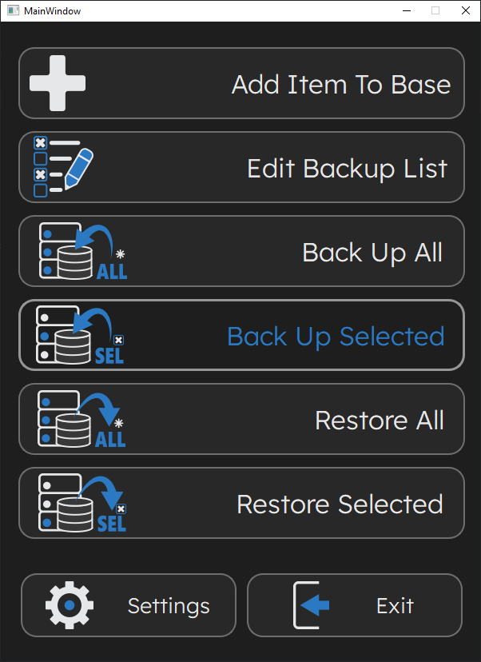
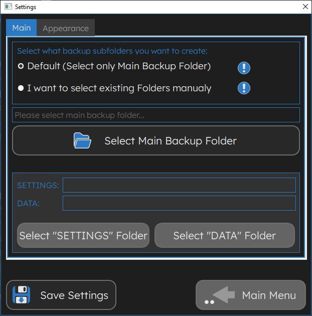

# EasyBack

Some very simple BuckUp utilitly with GUI on PySide2. For my learning operation with file system in
Python

First look for some elements of interface.

Home screen

<picture>
 <source media="(prefers-color-scheme: dark)" srcset="arhiv/screens/Screen_01.png">
 <source media="(prefers-color-scheme: light)" srcset="arhiv/screens/Screen_01.png">
 
</picture>

One button warning

<picture>
 <source media="(prefers-color-scheme: dark)" srcset="arhiv/screens/Screen_04.png">
 <source media="(prefers-color-scheme: light)" srcset="arhiv/screens/Screen_04.png">
 
</picture>

Add new items to back up list

<picture>
 <source media="(prefers-color-scheme: dark)" srcset="arhiv/screens/Screen_02.png">
 <source media="(prefers-color-scheme: light)" srcset="arhiv/screens/Screen_02.png">
 
</picture>

Settings dialog (some preview, not finished)

<picture>
 <source media="(prefers-color-scheme: dark)" srcset="arhiv/screens/Screen_03.png">
 <source media="(prefers-color-scheme: light)" srcset="arhiv/screens/Screen_03.png">
 
</picture>

